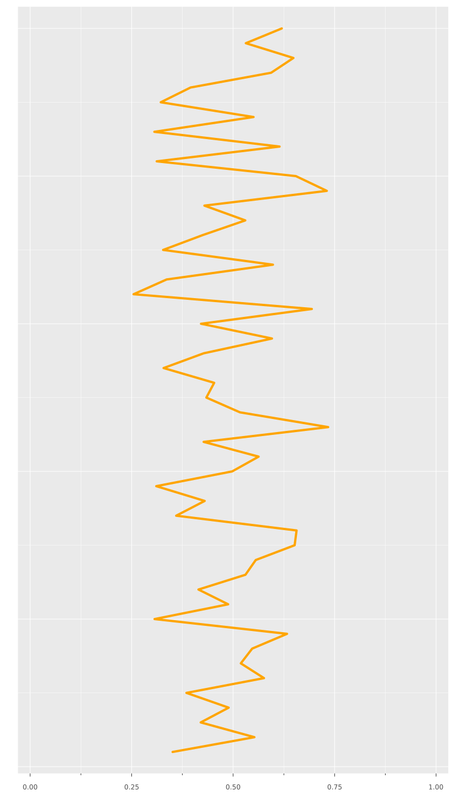
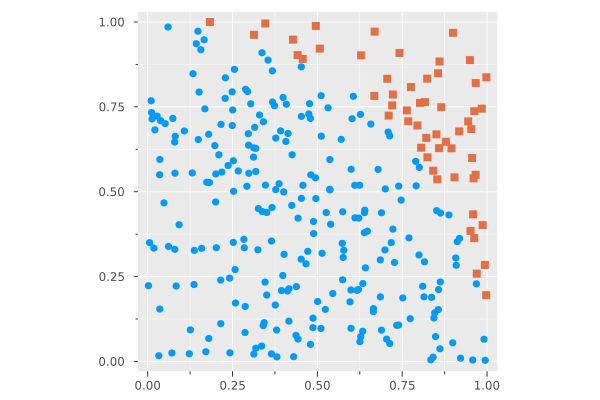
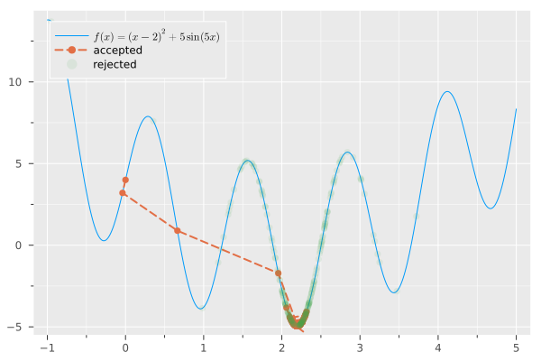
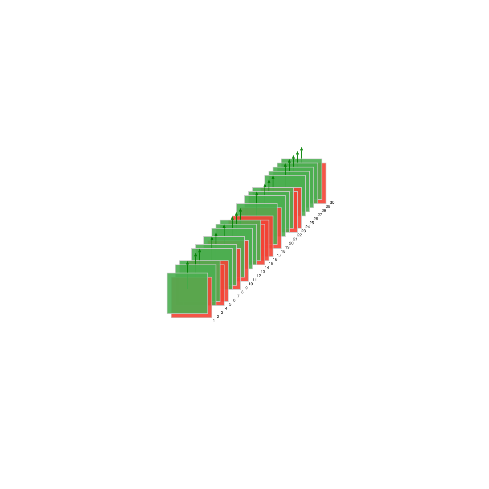
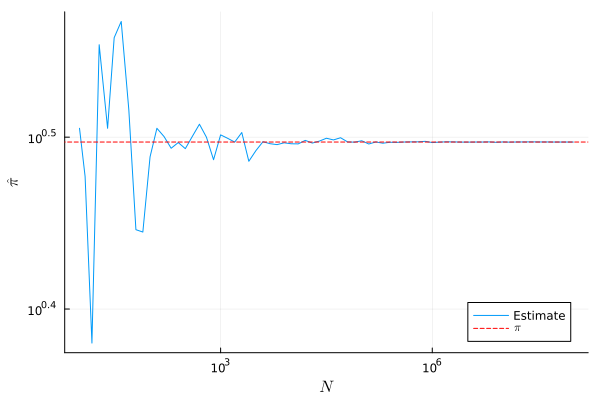
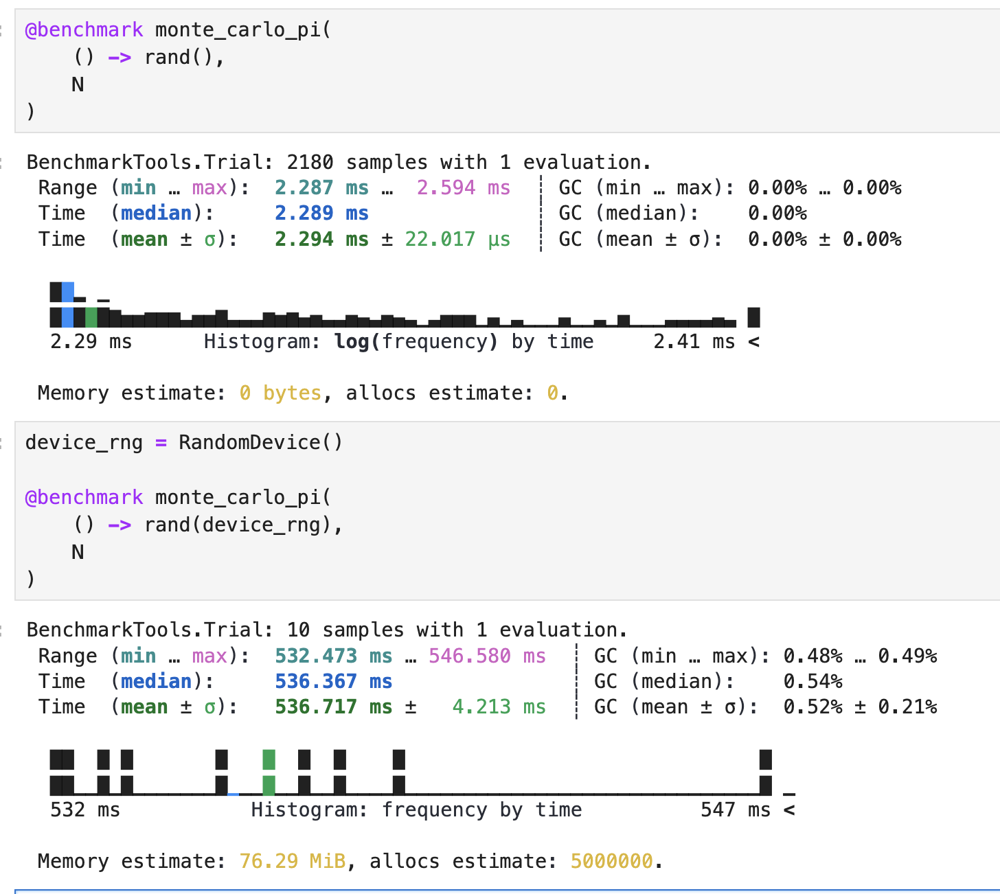

<!-- _header: 自己紹介 -->
  

<style scoped>
    tbody tr {
        background-color: white;
    }


    img {
        vertical-align: middle;
    }

    .columns {
        display: flex;
        flex-direction: row;
        justify-content: space-between;
    }

    .column1 {
        width: 40% !important;
    }

    .column2 {
        width: 70% !important;
    }
</style>


<div class="columns">

<div class="column1">


   [@abap34](https://github.com/abap34)          [@abap34](https://twitter.com/abap34) 

      https://abap34.com       

</div>


<div class="column2">

**所属**

東京工業大学情報理工学院 情報工学系 B3

**趣味**

- 個人開発 :gear:
- 機械学習 :robot:
- 最近は自炊をすること :cook:


</div>


</div>

---


<!-- _header: 今日のおはなし -->
<!-- _class: lead -->

<style scoped>

h1 {
    font-size: 3.4em;
    font-weight: bold;
    text-align: center;

}


    body {
        background: rgba(255, 255, 255, 0.8);
    }


</style>


# 乱数 


# ⇩


---


<!-- _class: lead -->

<style scoped>

h1 {
    font-size: 3.4em;
    font-weight: bold;
    text-align: center; 
    background: rgba(255, 255, 255, 0.8) !important;
}


</style>

<div class="transition">

# <span style="color: orange"> 現代の </span>
# <span style="color: orange;">擬似</span> 乱数
# <span style="color: orange"> あれこれ </span>

</div>


---


<style scoped>

.toc {
    display: flex;
    flex-wrap: wrap;
    flex-direction: column;
    margin: 10px;
    padding: 10px;
    overflow-y: hidden;
    overflow-x: hidden;
    box-sizing: border-box;
    box-shadow: 0 0 0 1000px #f0f8ff;
    align-items: stretch;
    justify-content: space-between;
    box-sizing: border-box;
}

.toc .toc-sec {
    margin: 10px;
    box-sizing: border-box;
     flex: 1 1 calc(30% - 40px); /* 2列に並べる */
    min-width: 300px; /* 必要に応じて最小幅を設定 */
    border: 1px solid #ccc;
    border-radius: 10px;
    padding: 20px;
    background-color: #f0f8ff; 
}

.toc .secname {
    font-size: 0.85em;
    font-weight: bold;
}

.toc .content {
    font-size: 0.7em;
    text-align: left;
}

.toc .content ul {
    list-style-type: none;
    padding-left: 0;
}

.toc .content ul li::before {
    content: "▶︎ ";
    font-size: 0.5em;
    margin-right: 5px;
}

</style>

<div class="toc">

<div class="toc-sec">

<div class="secname">

[1] イントロダクション

</div>

<div class="content">

- 乱数とは？
- 真の乱数
- 乱数生成と再現性
- 擬似乱数

</div>

</div>

<div class="toc-sec">

<div class="secname">

[2] 擬似乱数生成

</div>

<div class="content">

- 線形合同法
- Mersenne Twister
- Xorshift

</div>

</div>

<div class="toc-sec">

<div class="secname">

[3] 並列実行と再現性

</div>

<div class="content">

- 並列処理入門
- 並列実行によって再現性が失われる例

</div>

</div>

<div class="toc-sec">

<div class="secname">

[4] Julia における乱数生成

</div>

<div class="content">

- Julia の乱数生成のインターフェース
- `TaskLocalRNG` の原理と実装
- 移行の議論を振り返る

</div>


</div>

<div class="toc-sec">

<div class="secname">

[5] そのほかの例


</div>

<div class="content">

- Numpy における例
- jax における例

</div>


</div>

<div class="toc-sec">

<div class="secname">

[6] まとめ

</div>

<div class="content">

</div>

</div>

</div>

---

<style scoped>

.toc-sec .secname {
    font-size: 1.4em;
    font-weight: bold;
    padding: 0;
    margin: 0;
}

.toc-sec .content {
    font-size: 1.2em;
    text-align: left;
    padding: 0;
    margin: 0;
}

.toc-sec ul li {
    list-style-type: none;
}

.toc-sec ul li::before {
    content: "▶︎  ";
    font-size: 0.5em;
    margin-right: 5px;   
}

</style>


<div class="toc-sec">

<div class="secname">

[1] イントロダクション

</div>

<div class="content">

- 乱数とは？
- 真の乱数
- 乱数生成と再現性
- 擬似乱数

</div>

</div>

---
<!-- _header: 乱数とは？ -->

<div class="def">

### [定義] 乱数列 (ゆるふわ)
規則性がない、
つぎの値が予測できない列


</div>




---

<!-- _header: 乱数を使うとき -->


**✅ 世の中は乱数
(のように見えるもの) で溢れている**

- ギャンブル
- 株価
- 気象現象

などなど...

⇨ 計算機上でシミュレートするときに乱数が必要


---

<!-- _header: 乱数を使ったさまざまな計算例: モンテカルロ法 -->

## モンテカルロ法 ... 乱数を使った数値計算 

例) モンテカルロ法で $\pi$ の近似値を求める 

<!--   -->

```julia-repl
julia> monte_carlo_pi(n) = 4 * mean(rand()^2 + rand()^2 < 1 for _ in 1:n)
monte_carlo_pi (generic function with 1 method)

julia> monte_carlo_pi(10^9)
3.141590948
```

<div class="cite">

⚠️ 出てくるソースコードはスペースの都合上簡易的であったり色々と省略されています。
すべての完全なソースコードは https://github.com/abap34/juliatokyo12/tree/main/src に掲載されています。

</div>


---

<!-- _header: 例) 焼きなまし法 -->


焼きなまし法 
(Simulated Annealing)
 
による最小化

```julia
function anealing(f::Function, init::Float64)
    xᵢ₋₁ = init
    fxᵢ₋₁ = f(xᵢ₋₁)
    while T > ε
        T *= α
        xᵢ = neighbor(xᵢ₋₁, T)
        fxᵢ = f(xᵢ)
        if fxᵢ < fxᵢ₋₁ || random_accept(fxᵢ, fxᵢ₋₁, T)
            xᵢ₋₁, fxᵢ₋₁ = xᵢ, fxᵢ
        end
    end
    return xᵢ₋₁, fxᵢ₋₁
end
```



<div class="cite">

https://ja.wikipedia.org/wiki/%E7%84%BC%E3%81%8D%E3%81%AA%E3%81%BE%E3%81%97%E6%B3%95

</div>

---

<!-- _header: 例) 深層学習での乱数たち -->

1. ミニバッチのサンプリング
2. パラメータの初期化
3. Dropout
4. Augmentation

などなど...

<div style="text-align: center;">


# <span class="orangelined">乱数だらけ！</span>


</div>




---

<!-- _header: 乱数生成のことを考えよう -->

## 世の中と計算機は乱数に溢れてる 🌋

## ⇨ 実際どうやるか考えよう


---


<!-- _header: ここからの目標 -->

## ⚠️ ここからは $[0, 1)^d$ から一様に値を取ってくる方法を考えます

## <ruby>⇨<rp>(</rp><rt>why?</rt><rp>)</rp></ruby> 一様分布に従う乱数から、 <br> 所望の分布に従う乱数に変換する方法が知られているため 📝


<span style="font-size: 0.8em;">
(そして、この方法はこの資料の本筋ではないので割愛します

興味がある方は、キーワード: 逆関数サンプリング, 棄却サンプリング　などで調べる

<div style="text-align: center;">

or

</div>

パターン認識の教科書などを参照してみてください)

</span>


---


<!-- _header: 乱数の作り方 -->


<div class="columns">

<div>


ユーザ目線...


✅ たいていのプログラミング言語の
標準ライブラリで
 
**「乱数を生成する機能」**

が提供されている


</div>


<div>


例1) Python

```python
>>> import random
>>> random.random() 
0.2176257387331907 
```

例2) C++

```cpp
#include <random>

int main() {
    std::mt19937 engine(34);
    std::uniform_real_distribution<> dist(0, 1);
    std::cout << dist(engine) << std::endl;
}
```

例3) Julia

```julia-repl
julia> rand()
0.028646780286208817
```

</div>


</div>

---

<!-- _header: 乱数の作り方 -->


<div class="columns">

<div>


なんなら OS や CPU命令のレベルでも
提供されている


- [`/dev/random`](https://ja.manpages.org/random/4)
- [`/dev/urandom`](https://ja.manpages.org/random/4)
- [`getrandom` システムコール](https://man7.org/linux/man-pages/man2/getrandom.2.html
)
- [`RDRAND` 命令](https://www.felixcloutier.com/x86/rdrand)

</div>

<div>


例) `getrandom(2)` を使った乱数生成

```c
#include <sys/random.h>

int main() {
    int rand;
    getrandom(&rand, sizeof(rand), 0);
    printf("random number: %d", rand);
}
```

<span style="font-size: 0.8em;">https://onecompiler.com/c/42pn5drwx</span>


</div>

</div>

---

<!-- _header: 乱数を計算機で作るには？ -->


<div class="box">

### [定義 (再掲)] 乱数列 (ゆるふわ)
規則性がない、
つぎの値が予測できない列

</div>


<div style="text-align: center;">

⇩ ⚠️


<div class="thm">

<br>

**決定的な動作しかしない計算機上では、「規則性が <span class="dot-text">ない</span>」列は生成できない.**

<br>

</div>


</div>

---

<!-- _header: 乱数生成のアプローチ -->


## <span class="bluelined">アプローチ1: 外から持ってくる.</span>

例1) `/dev/random`: キーボード入力のような環境からの入力をもとにした予測困難な情報を貯めておいて、 (エントロピープール) そこから計算をして乱数を生成する [^1][^2]

例2) [BRNG (Banana Random Number Generator)](https://atmarkit.itmedia.co.jp/flinux/rensai/watch2008/watch01b.html): バナナに含まれる放射性カリウムの崩壊を観測して乱数を生成する


<div class="cite">

[1] 一部の OS では `/dev/random` でも擬似乱数 (後述) を使っていたようです。(例えば FreeBSD は動作環境が特定されやすいので環境ノイズが予測されやすく、
よく設計された擬似乱数生成器の方が安全という判断によるものらしいです。)　さらに Linux でも `/dev/random` 周りではいろいろと変化があり、
多くの情報が古くなっていそうです。例えば Linux Kernel v5.6 以降では `/dev/random` はエントロピープールが枯渇してもブロックされなくなりました。
[2] 情報源として、 Linux ではネットワークの情報を使ったり使わなかったりとかいろいろと変化や議論があったみたいです。
例えば、 2008年の記事ですが以下のようなものがあります: https://atmarkit.itmedia.co.jp/flinux/rensai/watch2008/watch01b.html

</div>


---

<!-- _header: 乱数生成のアプローチ1. -->

これらの方法は (とってくる情報がちゃんとしていれば) 実際予測できない

<div style="text-align: center;">

⇩

## <span class="orangelined">「真の乱数」</span> 

(True Random Number, TRNG) 

## とよばれる

</div>

---

<!-- _header: 真の乱数の困るところ -->

✅ 真の乱数は「予測できない」という乱数の本来の性質を忠実に持っている！

⇨ 例えば、パスワードの生成などではとても便利・たぶん安全


```bash
➤ cat /dev/random | head -c 10 | base64
UacNyS/a8zKKnw==
```

---

<!-- _header: 乱数生成と再現性 -->

プログラムの <span style="font-size: 2.0em;" class="bluelined">**再現性**</span>　


## :man: < 同じプログラムを実行したら、同じ結果になってほしい。


---


<!-- _header: 乱数生成と再現性 -->

例) 乱数を生成する関数を受けとって、モンテカルロ法で $\pi$ の近似値を求める関数

```julia
using Random

function monte_carlo_pi(sampler, N)
    inside = 0
    for i in 1:N
        x = sampler()
        y = sampler()
        if x^2 + y^2 < 1
            inside += 1
        end
    end
    return (4 * inside) / N
end
```

<div class="cite">

C言語版: https://onecompiler.com/c/42prbqnjz

</div>

---

<!-- _header: 乱数生成と再現性 -->

✅ Julia では `rng = RandomDevice()` として `/dev/random` から乱数を生成することができる [^1]

```julia-repl
julia> rng = RandomDevice()
RandomDevice()

julia> rand(rng)
0.3809207951383946

julia> rand(rng)      # 引数で RNG を指定すること以外は見た目はまったく rand() と同じ
0.5802374206262335
```


<div class="cite">

[1] [内部的には `Libc.getrandom!` が呼ばれます。](https://github.com/JuliaLang/julia/blob/9650510b5fa64571178cb9fe8b6799060ae0a3ac/base/libc.jl#L415) `Libc.getrandom!` は　https://docs.libuv.org/en/v1.x/misc.html#c.uv_random　を呼んでいて、これが `getrandom(2)` を使うか、
 直接 `/dev/random` を読みます。

</div>

---

<!-- _header: 乱数生成と再現性 -->

<br>
<br>

実行のたび、計算結果は変わる。 **( <span class="dot-text">乱数</span>  だから)**　

<div style="font-size: 0.9em;"> 

```julia-repl
julia> N = 10^6
1000000

julia> device_rng = RandomDevice()
RandomDevice()

julia> monte_carlo_pi(
           () -> rand(device_rng),
           N
       )
3.13876

julia> monte_carlo_pi(
           () -> rand(device_rng),
           N
       )
3.1438
```

</div>


---

<!-- _header: 乱数生成と再現性 -->

「パスワードの生成」が再現できる必要はないが、例えば

- 今のようなモンテカルロ法での計算
- ランダムテスト
- 機械学習モデルの訓練

で、「たまたまうまくいって二度と同じ結果を出せない」のはとても困る 😒
(検証がとても大変)


---

<!-- _header: 乱数生成のパフォーマンス -->

- 最近では非常に大量の乱数が必要な計算が増えている！ 
  (例: モンテカルロ積分は $n \rightarrow \infty$ で確率収束するので $n$ がたくさんあると気持ちが安心)
- 乱数生成がボトルネックになるような計算もたくさん 
  (言語比較のベンチマーク失敗あるある)



---

<!-- _header: 乱数生成のパフォーマンス -->


✅ **システムコールをたくさん呼ぶので、真の乱数生成はパフォーマンスが悪いがち**


例) $N = 10^6$ で円周率計算

| 生成 | 実行時間 [ms] |
| --- | --- |
| `rand()` | 2.289 |
| `rand(RandomDevice())` | <span style="color: red;">  536.367  </span> |




---

<!-- _header: 擬似乱数 -->

## `rand()`  ← やたらと高速なこれ (デフォルト乱数生成器) は何者?

---


<!-- _header: そこで擬似乱数ですよ -->

## <span class="bluelined">アプローチ2: 擬似乱数生成器 <br>(Pseudo Random Number Generator, PRNG)</span>

- 決定的な動作のみで、 **<span class="dot-text">乱数っぽいもの</span>** を作る
- たいていのプログラミングの標準ライブラリで 「乱数生成器」 として提供される


<div class="cite">

暗号論の文脈では、もう少し厳密に擬似乱数の定義について議論ができますが、 (筆者があまり詳しくないので) この資料ではあまり触れません。
興味がある方は https://www.ieice-hbkb.org/files/01/01gun_03hen_11.pdf などを参考にすると良さそうです。

</div>


---
