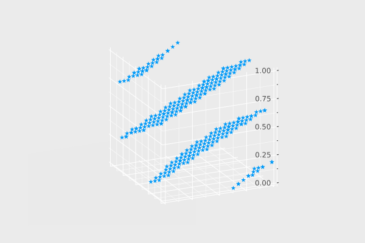

<div class="toc-sec">

<div class="secname">

[2] 擬似乱数生成

</div>

<div class="content">

- 線形合同法
- Mersenne Twister
- Xorshift

</div>

</div>

---

<!-- _header: 擬似乱数生成 -->

決定的なアルゴリズムのみによって、「乱数」 (のように見えるもの) を作る。

👇 実際に見てみた方がたぶん早いので、いくつかのアルゴリズムを紹介


---


<!-- _header: 擬似乱数生成 -->

👇 どうも乱数っぽい配列

```
100-element Vector{Float64}:
 0.24924475536681712
 0.36249492410570383
 0.0996150195132941
 0.9264233387075365
 0.043930134968832135
 ⋮
 0.643334295367822
 0.2540650968439877
 0.9413922114763409
 0.10687562916427851
 0.392702643526718
 0.603784283157438
```


---

<!-- _header: 擬似乱数生成 -->

<div class="columns">

<div>

実は、

$$
X_{n+1} = aX_n + c \mod M \quad (n = 0, 1, 2, \ldots)
$$

を

$$
\begin{cases}
X_0 &= 1 \\
a &= 48271 \\
c &= 0 \\
M &= 2^{31} - 1
\end{cases}
$$


として計算したときの $X_1, X_2, \ldots, X_{100}$ (を $m$ で割って $[0, 1)$ に収めたもの) 
が先ほどの配列！

</div>

<div>

```
100-element Vector{Float64}:
 0.24924475536681712
 0.36249492410570383
 0.0996150195132941
 0.9264233387075365
 0.043930134968832135
 ⋮
 0.643334295367822
 0.2540650968439877
 0.9413922114763409
 0.10687562916427851
 0.392702643526718
 0.603784283157438
```

</div>

</div>

<div class="cite">

パラメータは C++ の [`std::minstd_rand`](https://cpprefjp.github.io/reference/random/minstd_rand.html) と同じものを使っています。

</div>


---

<!-- _header: 線形合同法 -->

<br>


<div class="def">

## [線形合同法]

乱数シード: $X_0$ とパラメータ: $a, c, M$ のもとで

$$
X_{n+1} = (aX_n + c) \mod M
$$

として得られる $X_1, X_2, \ldots$ によって乱数を生成するアルゴリズム


</div>

---

<!-- _header: 擬似乱数生成によるメリット -->

1. 単に決定的なアルゴリズムを実行しているだけなので、
   **どの計算機でも
   「シード ($X_0$) 」を固定すれば <span class="orangelined">常に同じ結果が得られる！</span>**


2. **とても高速！** (真の乱数比)


---

<!-- _header: 線形合同法のいいところ -->


### ✅ とても <span class="dot-text">高速</span> (加算、乗算、剰余演算を 1 回ずつ)
### ✅ とても <span class="dot-text">省メモリ</span> (生成器の状態としては $a, c, M, X_i$ だけあればよい)
### ✅ とても <span class="dot-text">実装が楽！</span> (<span style="font-size: 0.8em;">`rand(n, x, a, c, M) = [x = (a * x + c) % M for _ in 1:n]`</span> だけ)


---

<!-- _header: 線形合同法のやばいところ -->

## 分布が偏ることがある

- <span class="orangelined">**多次元結晶構造**</span> ができる

---

<!-- _header: 多次元結晶構造 -->


(見やすさのために) 
パラメータとして

$$
\begin{cases}
X_0 &= 1 \\
a &= 45 \\
c &= 1 \\
M &= 256
\end{cases}
$$


を使って $[0, 1)^2$, $[0, 1)^3$ の中に点を打ってみると... 👉


```julia
sample2d!(rng::LCGPRNG) = sample!(rng, 2) 
sample3d!(rng::LCGPRNG) = sample!(rng, 3) 
```




---

<!-- _header: 多次元結晶構造 -->

<div style="text-align: center;">


満遍なく値をとらず、規則的な並びになってしまった！


⇩　なぜ？


</div>


---

<!-- _header: 多次元結晶構造の原因 -->

<style scoped>
   .thm {
      padding: 0px 50px 20px 50px;
   }

   .proof {
      padding: 0px 50px 10px 50px;
   }
</style>


先ほども出た性質...  **<span style="color: red;"> $X_{n+1}$ は $X_n$ のみによって一意に定まる. </span>**

ここから次のことが分かる.

<div class="thm">

### [定理]

**$x$ 座標が等しい相異なる二つの点が得られることはない**


</div>

($\because$ 上の性質から $y$ 座標は $x$ 座標のみによって一意に定まる)


---

<!-- _header: 多次元結晶構造の原因 -->

<div style="text-align: center;">
⇩

</div>

理想的には全ての点から平等に選ばれてほしいが、

<span class="orangelined">**$N$-クイーン問題 (の斜めなしver) の制約を満たす点のみから選ばれ、**
</span>　

一様な分布が得られない可能性がある. [^1][^2][^3]


<div class="cite">

[1] よりきちんと述べると、線形合同法を使って $[0, 1)^d$ に点を打つと、全ての点は $(d! \cdot M)^{1/d}$ 個の並行な超平面に乗ります。 (Marsagliaの定理)　
[2] 実際には、この各超平面の間隔が狭ければ一様な感じになるので、多くの用途で使える疑似乱数になります。実際、線形合同法が標準的な乱数生成器だった時代でも、
きちんとしたコンパイラのパラメータなら3次元でも割と一様だったようです。
[3] この観点での「好ましさ」を図る方法として「スペクトル検定」という乱数検定があります。詳しいアルゴリズムは、この資料末尾の参考文献1. を参照してください。


</div>