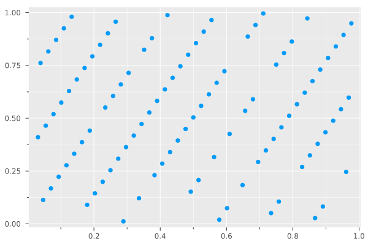

<div class="toc-sec">

<div class="secname">

[2] 擬似乱数生成と検定

</div>

<div class="content">

- 擬似乱数生成
- 線形合同法
- スペクトル検定

</div>

</div>

---

<!-- _header: そこで、擬似乱数 -->

## <span class="bluelined">アプローチ2: 擬似乱数生成器 <br>(Pseudo Random Number Generator, PRNG)</span>

- 決定的な動作のみで、 **<span class="dot-text">乱数っぽいもの</span>** を作る
- たいていのプログラミングの標準ライブラリで 「乱数生成器」 として提供される


<div class="cite">

暗号論の文脈では、もう少し厳密に擬似乱数の定義について議論ができますが、 (筆者があまり詳しくないので) この資料ではあまり触れません。
興味がある方は https://www.ieice-hbkb.org/files/01/01gun_03hen_11.pdf などを参考にすると良さそうです。

</div>


---

<!-- _header: 擬似乱数生成 -->

- 決定的なアルゴリズムのみによって、「乱数」 (のように見えるもの) を作る。

---

<!-- _header: 一つめの例: 線形合同法 -->

## ⚠️ この例で伝えたいこと: 

<div class="columns">

<div>


# 🙆‍♀️

## ⭕️ 乱数の質、検定の考え方

</div>

<div>

# 🙅‍♀️

## ❌ 線形合同法の網羅的な説明

</div>

</div>


---


<!-- _header: 擬似乱数生成 -->

👇 どうも乱数っぽい配列

```
100-element Vector{Float64}:
 0.24924475536681712
 0.36249492410570383
 0.0996150195132941
 0.9264233387075365
 0.043930134968832135
 ⋮
 0.643334295367822
 0.2540650968439877
 0.9413922114763409
 0.10687562916427851
 0.392702643526718
 0.603784283157438
```


---

<!-- _header: 擬似乱数生成 -->

<div class="columns">

<div>

実は、

$$
X_{n+1} = aX_n + c \mod M \quad (n = 0, 1, 2, \ldots)
$$

を

$$
\begin{cases}
X_0 &= 1 \\
a &= 48271 \\
c &= 0 \\
M &= 2^{31} - 1
\end{cases}
$$


として計算したときの $X_1, X_2, \ldots, X_{100}$ (を $m$ で割って $[0, 1)$ に収めたもの) 
が先ほどの配列

</div>

<div>

```
100-element Vector{Float64}:
 0.24924475536681712
 0.36249492410570383
 0.0996150195132941
 0.9264233387075365
 0.043930134968832135
 ⋮
 0.643334295367822
 0.2540650968439877
 0.9413922114763409
 0.10687562916427851
 0.392702643526718
 0.603784283157438
```

</div>

</div>

<div class="cite">

パラメータは C++ の [`std::minstd_rand`](https://cpprefjp.github.io/reference/random/minstd_rand.html) と同じものを使っています。

</div>


---

<!-- _header: 線形合同法 -->

<br>


<div class="def">

## [線形合同法]

乱数シード: $X_0$ とパラメータ: $a, c, M$ のもとで

$$
X_{n+1} = (aX_n + c) \mod M
$$

として得られる $X_1, X_2, \ldots$ によって乱数を生成するアルゴリズム


</div>

---

<!-- _header: 擬似乱数生成によるメリット -->

1. 単に決定的なアルゴリズムを実行しているだけなので、
   **どの計算機でも
   「シード ($X_0$) 」を固定すれば <span class="orangelined">常に同じ結果が得られる！</span>**


2. **とても高速！** (真の乱数比)


---

<!-- _header: 線形合同法のいいところ -->


### ✅ とても <span class="dot-text">高速</span> (加算、乗算、剰余演算を 1 回ずつ)
### ✅ とても <span class="dot-text">省メモリ</span> (生成器の状態としては $a, c, M, X_i$ だけあればよい)
### ✅ とても <span class="dot-text">実装が楽！</span> (<span style="font-size: 0.8em;">`rand(n, x, a, c, M) = [x = (a * x + c) % M for _ in 1:n]`</span> だけ)


---

<!-- _header: 線形合同法のやばいところ -->

## 分布が偏ることがある

- <span class="orangelined">**多次元結晶構造**</span> ができる

---

<!-- _header: 多次元結晶構造 -->


(見やすさのために) 
パラメータとして

$$
\begin{cases}
X_0 &= 1 \\
a &= 45 \\
c &= 1 \\
M &= 256
\end{cases}
$$


を使って $[0, 1)^2$, $[0, 1)^3$ の中に点を打ってみると... 👉


```julia
sample2d!(rng::LCGPRNG) = sample!(rng, 2) 
sample3d!(rng::LCGPRNG) = sample!(rng, 3) 
```





---

<!-- _header: 多次元結晶構造 -->

<div style="text-align: center;">


満遍なく値をとらず、規則的な並びになってしまった！


⇩　なぜ？


</div>


---

<!-- _header: 多次元結晶構造の原因 -->

<style scoped>
   .thm {
      padding: 0px 50px 20px 50px;
   }

   .proof {
      padding: 0px 50px 10px 50px;
   }
</style>


**<span style="color: red;"> $X_{n+1}$ は $X_n$ のみによって一意に定まる. </span>**

ここから次のことが分かる.

<div class="thm">

### [線形合同法の基本的な性質]

(1) 同一周期で同じ数は二度と出現しない
(2) 得られる列は長さが高々 $M$ の周期を持つ　


</div>


---

<!-- _header: 多次元結晶構造の原因 -->

さらに、ここから

<div class="thm">

<br>

(1) **$x$ 座標が等しい相異なる点が得られることはない**
(2) **$y$ 座標が等しい相異なる点が得られることはない**


</div>

も分かる！ 
(👉 をよく見ると確かにそうなっている)


---

<!-- _header: 多次元結晶構造の原因 -->

<div style="text-align: center;">
⇩

</div>

:man: < 理想的には全ての点から平等に選ばれてほしい！　　が、

<span class="orangelined">**$N$-クイーン問題 (の斜めなしver) の制約を満たす点のみから選ばれることになり**
</span>　

一様な分布が得られない可能性がある. $^{*1}$


<div class="cite">

$*1$ より進んだ結果として、線形合同法を使って $[0, 1)^d$ に点を打つと、全ての点は $(d! \cdot M)^{1/d}$ 個の並行な超平面に乗ることが知られています。 (Marsagliaの定理)　


</div>


---

<!-- _header: スペクトル検定 -->


一方で、👉 のプロットのように
各超平面間の間隔が小さければ実用上は問題なさそう？

<div style="text-align: center;">

⇩

</div>

超平面の間隔を指標として使うことで良いパラメータかを評価できそう

<div style="text-align: center;">

⇩


**スペクトル検定** $^{*1}$


</div>


<div class="cite">

$*1$ 最初に書いたようにこの資料の本筋ではないので、具体的な定義やアルゴリズムは割愛します。興味があるかたは資料末尾の参考文献 [1] などが詳しいです。

</div>


---

<!-- _header: 乱数検定による乱数の評価 -->

👉 (とても時間があるなら、)

- 自分の使いたい擬似乱数に求められている性質を考える
- その性質を乱数検定でチェック


(検定にパス $\Rightarrow$ いい乱数 は偽だが
 検定に落ちる $\Rightarrow$ だめな乱数 は真)


<div class="cite">

右の画像は、 "RANDU" と呼ばれる、かつて19７０年代ごろに広く使われていた線形合同法のパラメータを使って三次元空間に点を打ったものです。かなり偏っているのがわかります。 これをスペクトル検定で調べると実際かなり大きい値が得られます。

</div>

---

<!-- _header: 線形合同法 -->

**線形合同法自体の性質を** まとめると...

- 実装はお手軽で
- 空間計算量も軽い

が、質の悪い乱数を生みがち 🫤

<span style="font-size: 0.8em;">(紹介したもの意外でも致命的な弱点がたくさん... 参考文献の [3] などをどうぞ）
</span>

### ⇨ <span class="orangelined"> 本当にメモリの制約が厳しい場合をのぞき、現代で使う場面はあまりない</span>

---

<!-- _header: この例で言いたかったこと -->

✅ 決定的な動作によって、「乱数っぽいもの」を生成できる 
✅ それがちゃんと「欲しい乱数」であるかは乱数検定をすることで **検討** できる

---

<!-- _header: Mersenne Twister -->
<br>

## 二つめの例: <span class="bluelined">Mersenne Twister</span> 

- Julia 1.6 まではデフォルトに採用されていた、とても実用的・主要な乱数生成器
https://docs.julialang.org/en/v1.6/stdlib/Random/
 <span style="font-size: 0.8em;">↑ Julia の Doc に広島大のページが貼られていて凄い</span>

- **多次元でも均等に分布する** ことが保証されている！
- 周期がとても長い！ ($2^{19937} - 1 \approx 10^{6000}$)
  - 線形合同法では、高々 $M$ 
- SIMD で高速化可能！ (http://www.math.sci.hiroshima-u.ac.jp/m-mat/MT/SFMT/index.html)

---

<!-- _header: Mersenne Twister -->

色々なところでデフォルトの乱数生成器として使われている / いた. 


```julia-repl
julia> versioninfo()
Julia Version 1.6.7
...
  LIBM: libopenlibm
  LLVM: libLLVM-11.0.1 (ORCJIT, westmere)

julia> Random.default_rng()
MersenneTwister(0xb64166ab5b12df4dc1df3351babcb816, (0, 1002, 0, 1))
```

<span style="font-size: 1.2em;">


> *Nobody ever got fired for choosing Mersenne Twister.* ─ Chris Wellons (https://nullprogram.com/blog/2017/09/21/) 


</span>

---

<!-- _header: Mersenne Twister ? -->

<br>

色々なところでデフォルトの乱数生成器として使われている / <span style="font-size: 1.2em;"><span style="color: red;">**いた**</span></span>

```julia-repl
julia> versioninfo()
Julia Version 1.11.0-rc2
Commit 34c3a63147b (2024-07-29 06:24 UTC)
...
  LLVM: libLLVM-16.0.6 (ORCJIT, apple-m2)
Threads: 1 default, 0 interactive, 1 GC (on 4 virtual cores)

julia> copy(Random.default_rng())
Xoshiro(0xd61a5db6fa36f012, 0xfe333f52e0297386, 0x303b3ad67aa60728, 0xb67bb83a380206b7, 0xde1ca16d107d0c59)
```

---


<!-- _header: Mersenne Twister ? -->

## 疑問: なぜ Julia は Mersenne Twister をやめたのか？ 🤔💭

⇨ <span style="font-size: 2.3em;">ヒントは、  <span class="dot-text">並列処理</span> </span>