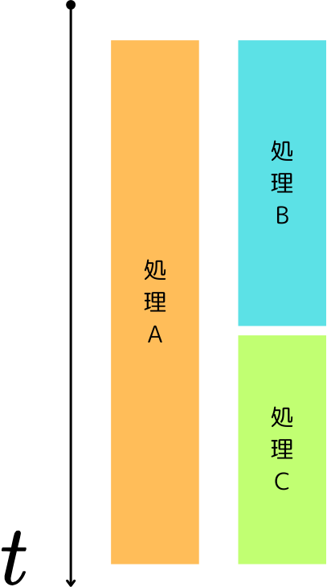
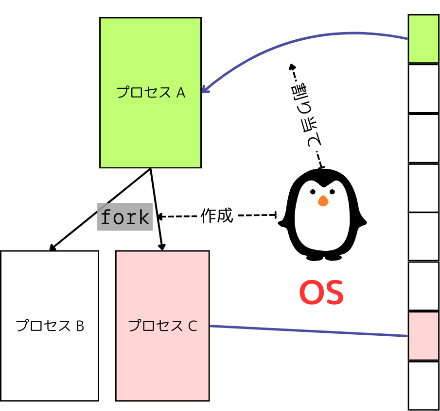
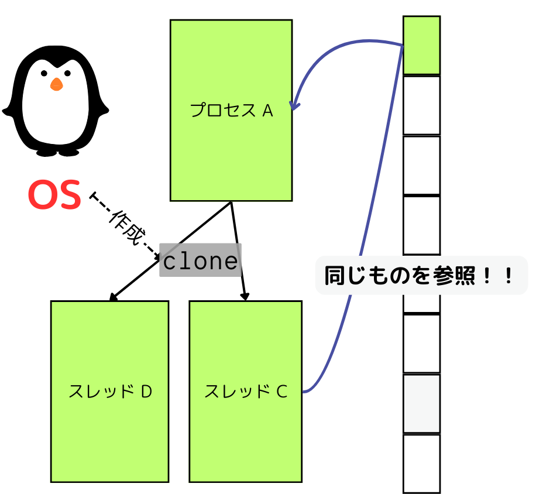

[3] 並列実行と再現性

- 並列計算入門
- 再現性が失われる例

---

<!-- _header: 並列計算 -->

## ✅ 重要な事実:
## 現代の科学技術計算は **並列化** 抜きには考えられない

---

<!-- _header: 並列計算入門 -->

### [並列処理 (Parallel Processing)] 

-  **同時点** で複数の計算を行うこと　$^{*1}$
- とてもとても単純に考えれば、 2つのことを同時にやれば2倍速くなるので、処理を早く終わらせることができる！

$^{*1}$ 逆に(?)、特定の期間で複数の計算を (実際の実行形態はともかく) 行うことを並行処理 (Concurrent Processing) と呼びます。

---

<!-- _header: プロセスとスレッド -->

## プロセス (Process)

- 実行中のプログラムのインスタンス
- OS は各プロセスにメモリ空間を割り当てたりして、各プロセスが独立して動作するようにしている

---

<!-- _header: プロセスとスレッド -->

## スレッド (Thread)

- 「軽量プロセス」とも 
- **同じプロセスから作られた他のスレッドとメモリ空間などを共有している**

---

<!-- _header: 並列計算入門 -->

 

 

## 1. マルチプロセス (Multiprocessing) 

- プロセスを複数立ち上げて、それぞれのプロセスで計算を行う
  - ので、メモリ空間は独立で、競合しづらい
  - 逆に、データのやりとりのオーバーヘッドが大きい
  - プロセスの作成自体も割と高コスト

## 2. マルチスレッド (Multithreading) 

- プロセス内で複数のスレッドを立ち上げて、それぞれのスレッドで計算を行う
  - メモリ空間は共有なので、データをメモリに置くだけで「通信」できる
  - 逆に、競合が起きて大変なことになる可能性がある
  - プロセスよりは作成が軽い

---
