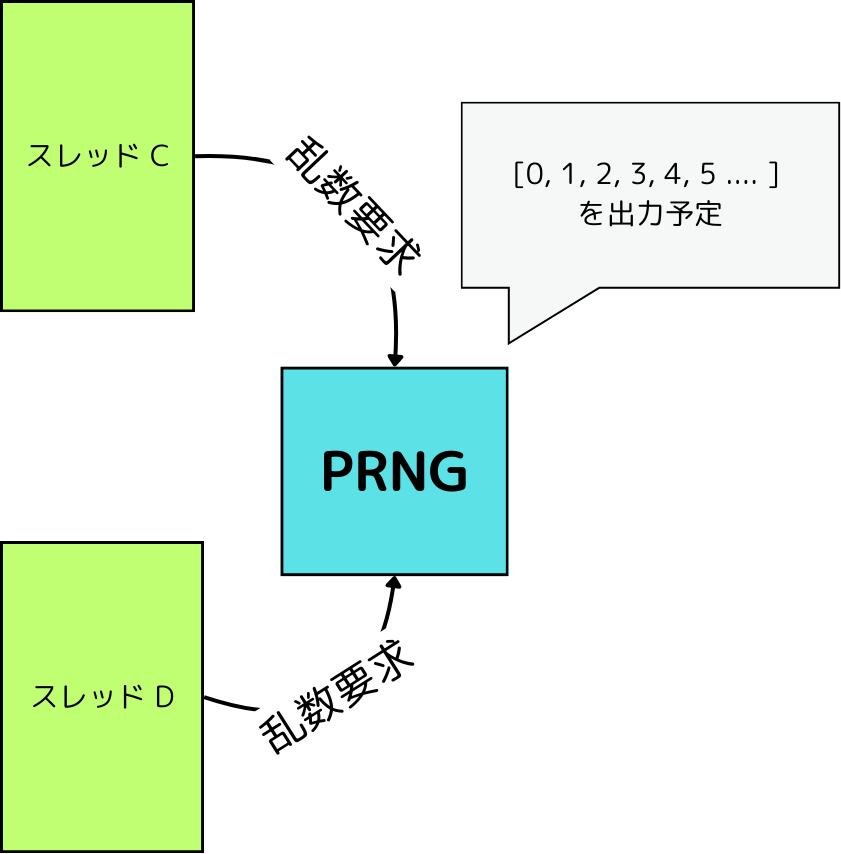

<div class="toc-sec">

<div class="secname">

[3] 並列実行と再現性

</div>

<div class="content">

- 並列計算入門
- 再現性が失われる例

</div>

</div>

---

<!-- _header: 並列計算 -->

## ✅ 重要な事実:
## 現代の科学技術計算は <span style="font-size: 1.5em;">**並列化**</span> 抜きには考えられない

---

<!-- _header: 並列計算入門 -->

<div class="def">

### [並列処理 (Parallel Processing)] 

- <span style="font-size: 1.2em; color:red;"> **同時点**</span> で複数の計算を行うこと $^{*1}$
- <span style="color: black;">とてもとても単純に考えれば、</span> 2つのことを同時にやれば2倍速くなるので、処理を早く終わらすことを目指せる


</div>


<div class="cite">

$^{*1}$ 逆に、特定の期間で複数の計算を (実際の実行形態はともかく) 行うことを並行処理 (Concurrent Processing) と呼びます。

</div>

---

<!-- _header: プロセスとスレッド -->

<div style="font-size: 0.9em;">


## <span class="bluelined">プロセス (Process)</span>

- 実行中のプログラムのインスタンス
- OS は各プロセスにメモリ空間を割り当てたりして、各プロセスが独立して動作するようにしている

</div>


---

<!-- _header: プロセスとスレッド -->

## <span class="bluelined">スレッド (Thread)</span>

- 「軽量プロセス」とも 
- **同じプロセスから作られた他のスレッドとメモリ空間などを共有している**


---

<!-- _header: 並列計算入門 -->

<br>

<br>

<div style="font-size: 0.9em;">

## 1. <span class="bluelined">マルチプロセス (Multiprocessing) </span>


- プロセスを複数立ち上げて、それぞれのプロセスで計算を行う
  - ので、メモリ空間は独立で、競合しづらい
  - 逆に、データのやりとりのコストが大きい
  - プロセスの作成自体も割と高コスト

## 2. <span class="bluelined">マルチスレッド (Multithreading) </span>

- プロセス内で複数のスレッドを立ち上げて、それぞれのスレッドで計算を行う
  - メモリ空間は共有なので、データをメモリに置くだけで「通信」できる
  - 逆に、競合が起きて大変なことになる可能性がある
  - プロセスよりは作成が軽い

</div>

---

<!-- _header: 並列計算の実行 1. マルチプロセス -->

<br>

<br>

✅ `Distributed` パッケージを使ってマルチプロセスによる並列計算ができる


<div style="font-size: 0.9em;">

```julia
using Distributed
using Random

N_WORKERS = 8

@everywhere using Statistics

@everywhere monte_carlo_pi(n) = 4 * mean(rand()^2 + rand()^2 < 1 for _ in 1:n)

function monte_carlo_distibuted(; N, N_WORKERS)
    tasks = [remotecall(monte_carlo_pi, i, N ÷ N_WORKERS) for i in workers()]
    return mean(fetch.(tasks))
end

println("Estimated: ", monte_carlo_distibuted(N=10^10, N_WORKERS=N_WORKERS))
```

</div>

---


<!-- _header: 並列計算の実行 1. マルチプロセス -->
<br>
<br>

$N = 10^{10}$ で計算してみると、

<div style="font-size: 0.9em;">


```bash
➤ time julia -p 8 --project="." src/3_parallel/mp_montecarlo.jl
Estimated: 3.1415537572

________________________________________________________
Executed in   12.71 secs    fish           external
   usr time   78.52 secs    0.09 millis   78.52 secs
   sys time    0.95 secs    1.25 millis    0.95 secs

➤ time julia --project="." src/3_parallel/montecarlo.jl
Estimated: 3.1415815196

________________________________________________________
Executed in   37.31 secs    fish           external
   usr time   37.32 secs   19.64 millis   37.30 secs
   sys time    0.33 secs    4.81 millis    0.32 secs
```


</div>

---


<!-- _header: 並列計算の実行 1. マルチプロセス -->

## 約3倍の高速化！ 

|  | マルチプロセス | シングルプロセス |
| --- | --- | --- |
| 実際の実行時間 | <span style="color: red;">**12.71 secs**</span> | 37.31 secs |
| ユーザー時間 | 78.52 secs | 37.32 secs |

---

<!-- _header: 並列計算の実行 2. マルチスレッド -->

<br>

✅ `Base.Threads` を使ってマルチスレッドによる並列計算ができる

```julia
using Base.Threads  
using Statistics

N_THREADS = 8
N = 10^10

monte_carlo_pi(N) = 4 * mean(rand()^2 + rand()^2 < 1 for _ in 1:N)

function monte_carlo_threaded(; N, N_THREADS)
    tasks = [Threads.@spawn monte_carlo_pi(N ÷ N_THREADS) for _ in 1:N_THREADS]
    return mean(fetch.(tasks))
end

println("Estimated: ", monte_carlo_threaded(N=N, N_THREADS=N_THREADS))
```


---

<!-- _header: 並列計算の実行 2. マルチスレッド -->


```bash
➤ time julia --threads 8  --project="." src/3_parallel/mt_montecarlo.jl
Estimated: 3.1415765036

________________________________________________________
Executed in    7.77 secs    fish           external
   usr time   50.13 secs    0.10 millis   50.13 secs
   sys time    0.45 secs    1.34 millis    0.45 secs
```

|  | マルチスレッド | マルチプロセス | シングルプロセス・スレッド |
| --- | --- | --- | --- |
| 実際の実行時間 | <span style="color: red;"><span style="font-size: 1.2em;">**7.77 secs**</span></span> | 12.71 secs | 37.31 secs |
| ユーザー時間 | 50.13 secs | 78.52 secs | 37.32 secs |


---

<!-- _header: 並列計算と再現性 -->

## 💡 並列計算をするときの再現性を考える.


---

<!-- _header: 復習: 再現性 -->

プログラムの <span style="font-size: 2.0em;" class="bluelined">**再現性**</span>　


## :man: < 同じプログラムを実行したら、同じ結果になってほしい。

---

<!-- _header:  復習: 再現性 -->

<br>

✅ 擬似乱数を使えば、 <span style="font-size: 1.0em;">**シード**</span> を固定することで、再現性を保った上で乱数が使えた.


```julia
using Random

Random.seed!(34)
rand(3)
# 3-element Vector{Float64}:
#  0.5142608579591283
#  0.7836918551121808
#  0.5253260048512097

Random.seed!(34)
rand(3)
# 3-element Vector{Float64}:
#  0.5142608579591283
#  0.7836918551121808
#  0.5253260048512097
```

---

<!-- _header: 並列計算と再現性 -->

状況: マルチスレッドでモンテカルロ法による円周率の高速化を考えてみる.

```julia
# 内部的に何かしらの状態をもつ、擬似乱数生成器
struct PRNG
   state
end

monte_carlo_pi(rng::PRNG, n)　= 4 * mean(rand(rng)^2 + rand(rng)^2 < 1 for _ in 1:n)

monte_carlo_pi(PRNG(), 10^6) # -> 3.1415...
```


<div style="text-align: center;">

⇩　マルチスレッドで計算

</div>


---

<!-- _header: 並列計算と再現性 -->

✅ 復習: 各スレッドでは**メモリ空間は共通**だった。

なので、特に何もしなくても「グローバルに一つの乱数生成器を参照する」

```julia
function monte_carlo_threaded(rng::PRNG; N, N_THREADS)
    tasks = [Threads.@spawn monte_carlo_pi(rng, N ÷ N_THREADS) for _ in 1:N_THREADS]
    return mean(fetch.(tasks))
end
```

---

<!-- _header: 並列計算と再現性 -->

✅ 復習: 各スレッドでは**メモリ空間は共通**だった。

なので、特に何もしないと <span style="color: red;">**「グローバルに一つの乱数生成器を参照する」**</span>

```julia
function monte_carlo_threaded(rng::PRNG; N, N_THREADS)
    tasks = [Threads.@spawn monte_carlo_pi(rng, N ÷ N_THREADS) for _ in 1:N_THREADS]
    return mean(fetch.(tasks))
end
```

---


<!-- _header: 再現性が失われる例 -->





<br>


それぞれのスレッドで乱数を要求すると、

| C | D |
| --- | --- |
| `[1, 2]` | `[3, 4, 5]` |
| `[1, 4]` | `[2, 3, 5]` |
...


⇨ **シードを固定することによって 
「<span class="dot-text">乱数生成器が出すもの</span>」
は変わらないが、各スレッドで得られるものは変わってしまう！**