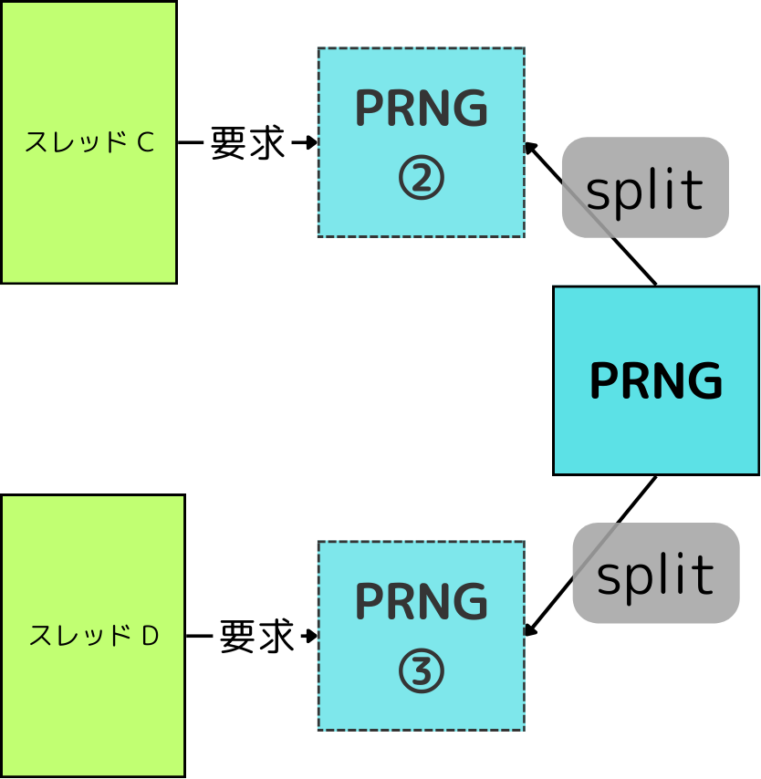
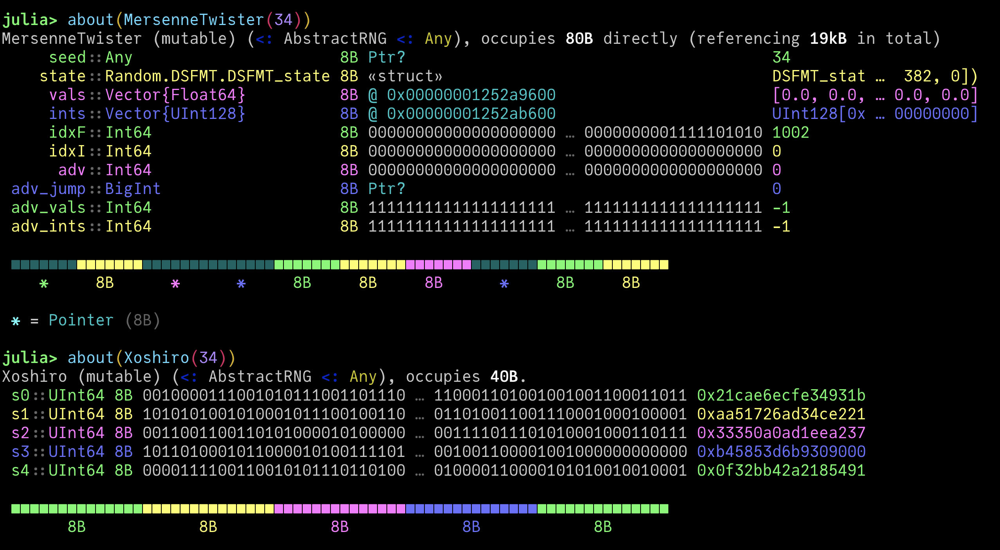

<div class="toc-sec">

<div class="secname">

[4] Julia における乱数生成

</div>

<div class="content">

- Julia の乱数生成のインターフェース
- `TaskLocalRNG` の原理と実装

</div>


</div>

---

<!-- _header: Julia の乱数生成のインターフェース -->

<br>

### [超基本]

1. `rand(prng)` で `prng` を使って乱数を生成
2. `Random.seed!(prng, seed)` で `prng` のシードを設定

```julia-repl
julia> prng = MersenneTwister(34)
MersenneTwister(34)

julia> rand(prng), rand(prng)
(0.5421693723520045, 0.8115228540860957)

julia> Random.seed!(prng, 34); rand(prng)
0.5421693723520045

julia> Random.seed!(prng, 34); rand(prng)
0.5421693723520045
```

---

<!-- _header: Julia の乱数生成のインターフェース -->

😞 毎回 `prng` を書くのは面倒な利用者も多い.

⇨ `prng` を省略すると、それらは全て `Random.default_rng()` に対して行われる
(https://github.com/JuliaLang/julia/blob/4c2f728a9976a5651acfe2f7eba703e6d0b64562/stdlib/Random/src/Random.jl#L258)

( 例えば `Random.seed!(34)` は  `Random.seed!(Random.default_rng(), 34)` と等価 )

---

<!-- _header: `TaskLocalRNG` の原理と実装 -->

`Random.default_rng()` を確認してみると、 `TaskLocalRNG` が帰ってくる！


```julia-repl
julia> Random.default_rng()
TaskLocalRNG()
```

---

<!-- _header: `TaskLocalRNG` の原理と実装 -->

Q. `TaskLocalRNG` とは？
A. その名のとおり、  <span style="font-size: 1.2em;">**`Task` 固有の乱数生成器.**</span>

<span style="font-size: 0.8em;">(※ `Task` についての話も含めるとかなり長くなってしまったので、省略します.
簡単には、 Julia における「実行」の単位と理解すれば十分で、プロセスと同じように実行・中断・再開ができるものです.`TaskLocalRNG` ついても、各スレッド固有の乱数生成器と考えても今回の話の流れとしては大丈夫です)</span>


---


<!-- _header: `TaskLocalRNG` の原理と実装 -->





<br>


- 共通の乱数生成器を使うと、乱数の要求タイミング次第で得られる乱数が異なる.

<div style="text-align: center;">

⇩

</div>

<div class="box" style="padding-top: 1.0em;">


新しいスレッドで計算を行うとき、

**[各スレッド用の乱数生成器を決定論的なアルゴリズムで作成して (task.c)](https://github.com/JuliaLang/julia/blob/4c2f728a9976a5651acfe2f7eba703e6d0b64562/src/task.c#L1094
)**、そこから取り出す ことで、 <span class="orangelined">**タイミングに依らず同じ結果になる！**</span>


</div>

<div class="cite">
　
この「作成」の方法については、参考文献 [7] などを参照してください.

</div>

---


<!-- _header: `TaskLocalRNG` の原理と実装 -->


<br>
<br>
<br>


😳  `Task` のレベルで乱数生成に介入している！！ 


<span style="font-size: 0.8em;">

(乱数生成が今どきどれくらい重要かを示唆していて、めちゃくちゃ面白い)


```c
void jl_rng_split(uint64_t dst[JL_RNG_SIZE], uint64_t src[JL_RNG_SIZE]) JL_NOTSAFEPOINT
{
    // load and advance the internal LCG state
    uint64_t x = src[4];
    src[4] = dst[4] = x * 0xd1342543de82ef95 + 1;
    // high spectrum multiplier from https://arxiv.org/abs/2001.05304

    // random xor constants
    static const uint64_t a[4] = {
            ...
        c *= m[i];
        c ^= c >> 43;
        dst[i] = c;
    }
}
```


<span style="font-size: 0.8em;">(https://github.com/JuliaLang/julia/blob/4c2f728a9976a5651acfe2f7eba703e6d0b64562/src/task.c#L1094)</span>

</span>

---

<!-- _header: xoshiro256++ -->

内部的には、 `xoshiro256++` というアルゴリズムを使っている.
(Xorshift という著名なアルゴリズムの派生)

```julia
julia> copy(Random.default_rng())
Xoshiro(0xf41c78cbc898a2cf, 0xbe2efdab9d7feb15, 
0x84443883cae5402c, 0xdd254c2b8a0684b1, 0xd003a1925dc045c1)
```

<ruby>⇨<rp>(</rp><rt>why?</rt><rp>)</rp></ruby> Mersenner Twister と比較して、 **圧倒的に内部状態が小さい。** 

⚠️ `Task` 生成レベルまで介入するので、パフォーマンスに非常に注意する必要がある！

<div class="cite">

それはそれとして、乱数の質なども含めて Mersenner Twister はどちらかというと古くなりつつあるようです。詳しくは参考文献の [5] や [6] を見てください.

</div>

---
<!-- _header: xoshiro256++ -->

<br>

<br>





<div style="text-align: center;">

**✅ `s1, s2, s3, s4` だけで OK.**

</div>

---

